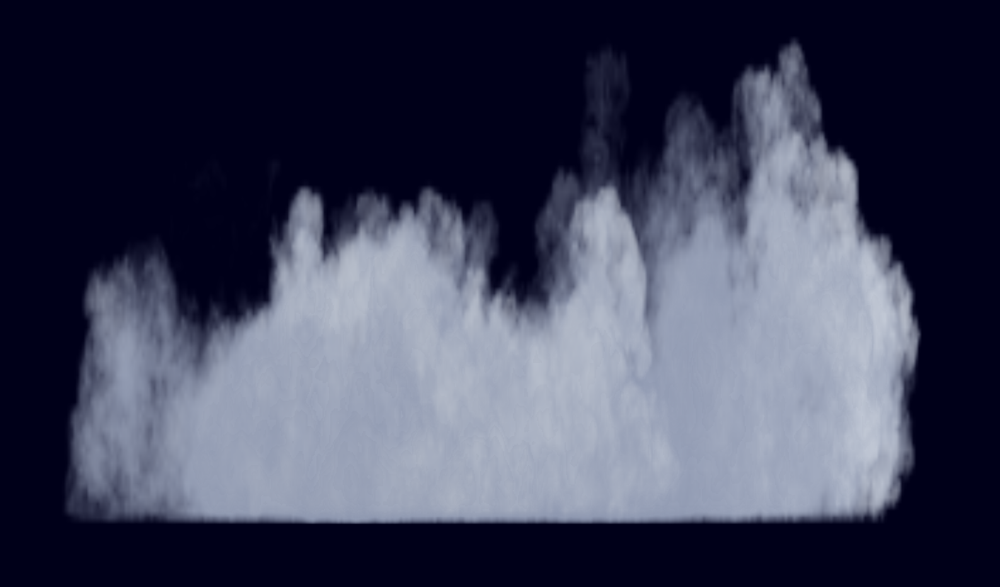
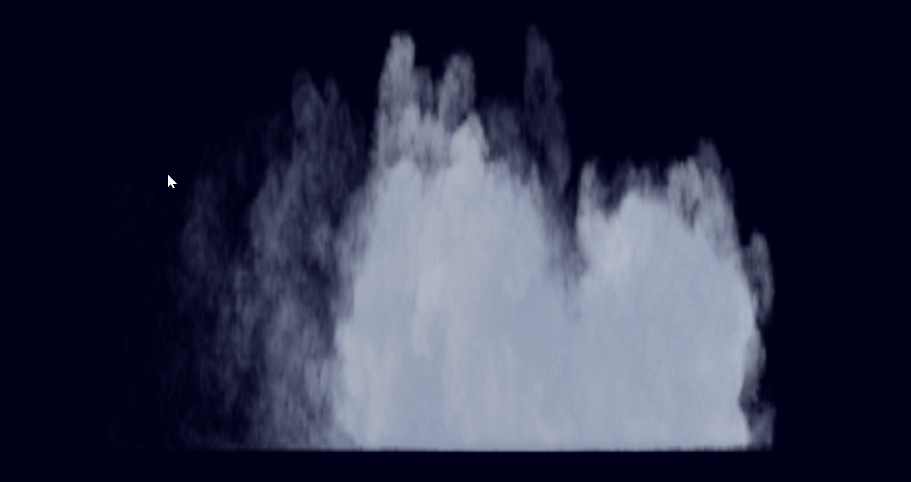

# clouds

## The project is still in progress.

Project was tested only on Windows machines.

# Installation

Install openvdb by using vpckg:
https://github.com/microsoft/vcpkg

After that in console type in:
*vcpkg install openvdb:x64-windows*
*vcpkg integrate install*

Change configuration in solution to *Release* to compile.

# Images

